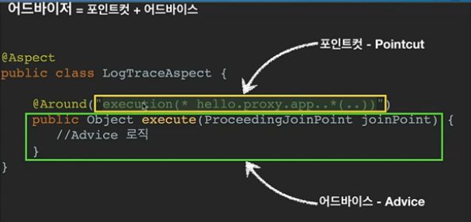

1. #### @Aspect 프록시 적용

   1. 포인트컷과 어드바이스로 구성되어있는 어드바이저 생성기능 지원
   2. AspectJ 프로젝트에서 제공하는 애노테이션이며, 스프링에서 채용한 패키지이다.

```java
import org.aspectj.lang.ProceedingJoinPoint;
import org.aspectj.lang.annotation.Around;
import org.aspectj.lang.annotation.Aspect;

@Aspect
public class LogTraceAspect {
	
	private final LogTrace logTrace;

	public LogTraceAspect(LogTrace logTrace) {
		super();
		this.logTrace = logTrace;
	}
	
	/**
	 * 어드바이저는 여러개 만들 수 있다.
	 * 
	 * @Around 포인트 컷
	 * @param joinPoint
	 * @return
	 * @throws Throwable
	 */
	@Around("execution(* hello.proxy.app..*(..))")
	public Object execute(ProceedingJoinPoint joinPoint) throws Throwable{
		TraceStatus status = null;
		try {
			String message = joinPoint.getSignature().toShortString();
			status = logTrace.begin(message);
			
			// 로직 호출
			Object result = joinPoint.proceed();
			
			logTrace.end(status);
			return result;
		} catch (Exception e) {
			logTrace.exception(status, e);
			throw e;
		}
	}
}


// @Aspect 클래스를 스프링 빈으로 등록
@Configuration
@Import({AppV1Config.class, AppV2Config.class})
public class AopConfig {
	
	@Bean
	public LogTraceAspect logTraceAspect(LogTrace logTrace) {
		return new LogTraceAspect(logTrace);
	}
}
```

2. #### @Aspect 프록시

   1. 프록시 = 여러 어드바이저

   2. 어드바이저 = 포인트컷 + 어드바이스

   3. 자동 프록시 생성기(AnnotationAwareAspectJAutoProxyCreator)

      -  @Aspect를 찾아서 이것을 Advisor로 만들어준다.
      - 어드바이저를 기반으로 프록시를  생성한다.

      

   4. 횡단 관심사 (cross-cutting concerns)
      - 애플리케이션의 여러 기능들 사이에 걸쳐서 들어가는 관심사
      - 횡단 관심사를 전문으로 해결하는 스프링 AOP

3. #### @Aspect 어드바이저 빌더

   - @Aspect 정보를 기반으로 어드바이저를 만들고 @Aspect 어드바이저 빌더 내부 저장소에 캐시한다.

4. #### 핵심기능과 부가기능

   1. 핵심기능 : 로직
   2. 부가 기능
      - 핵심기능을 보조하기 위해 존재. 로그 추적, 트랜잭션
      - 여러 곳에서 공통으로 사용하는 부가기능 (횡단 관심사 : cross-cutting concerns)
      - 부가기능 적용문제 : 부가기능을 적용해야하는 클래스가 100개면 100개 모두에 동일한 코드를 추가해야하며, 수정시 100개 모두에 동일한 수정이 발생한다. → 일반적으로 OOP방식으로는 해결하기 어렵다.
   
5. #### Aspect

   1. Aspect : 관점
   2. AOP
      - 관점 지향 프로그래밍
      - AOP는 OOP를 대체하기 위한 것이 아니라 OOP의 부족한 횡단 관심사 처리를 보조하기 위한 목적으로 개발된 것이다.
   3. 부가기능을 어디에 적용할지 선택하는 기능을 합해서 하나의 모듈로 만든 것
   4. AspectJ 프레임워크
      - 스프링도 AOP를 지원하지만 대부분 AspectJ의 문법을 차용하고, AspectJ가 제공하는 기능의 일부만 제공한다.
      - 오류검사 및 처리, 동기화, 모니터링 및 로깅 제공
   
6. #### AOP 적용방식

   1. ##### 컴파일 시점

      - .java 소스코드를 컴파일러를 사용해서 .class를 만드는 시점에 부가기능을 추가할 수 있다. 이경우 AspectJ가 제공하는 **특별한 컴파일러를 사용해야 한다**.
      - AspectJ 컴파일러는 Aspect를 확인해서 해당 클래스가 적용 대상인지를 먼저 확인하고 적용 대상인 경우에 부가 기능 로직을 적용한다.
      - 위빙(Weaving) : 원본 로직에 부가 기능 로직에 추가되는 것 (엮어 만들다)
      - **조인 포인트**(AOP를 적용할 수 있는 지점) : 생성자, 필드 값, static 메서드, 메서드 실행

   2. ##### 클래스 로딩 시점

      - 자바를 실행하면 자바 언어는 .class 파일을 JVM 내부의 클래스 로더에 보관한다. 이때 중간에서 .class파일을 조작한 다음 JVM에 올릴 수 있다. 자바 언어는 .class를 JVM에 저장하기 전에 조작할 수 있는 기능을 제공한다 (Java Instrumentation)
      - 로드 타임 위빙 : 자바를 실행할 때 특별한 옵션을 통해서 클래스 로더 조작기를 지정해줘야 한다.

   3. ##### 런타임 시점 (프록시)

      - 런타임  시점 : 자바가 실행되고 난 다음의 시점

      - 클래스 로딩시점이나 컴파일 시점에 비하면 AOP기능에 일부 제약

      - 조인포인트 : 메서드 실행 지점에만 적용 가능

      - 스프링 AOP : **스프링 빈에 등록된 개체에만 사용할 수 있다**는 한계점도 있음

7. #### AOP용어 정리

   1. 조인 포인트(Join Point)

      - 어드바이스가 적용될 수 있는 위치
      - 스프링 AOP는 프록시 방식을 사용하므로 조인 포인트는 항상 메소드 실행 지점으로 제한된다.

   2. 포인트 컷

      - 조인 포인트 주엥서 어드바이스가 위치를 선별하는 기능
      - 프록시를 사용하는 스프링 AOP는 메소드 실행 지점만 포인트컷으로 선별 가능

   3. 타겟

      - 어드바이스를 받는 객체. 포인트컷으로 결정

   4. 어드바이스

      - 부가기능

   5. 에스팩트 (Aspect)

      - [어드바이스 + 포인트컷]을 모듈화 한 것
      - @Aspect

   6. 어드바이저

      - 하나의 어드바이저와 하나의 포인트 컷으로 구성

   7. 위빙 (Weaving)

      - 포인트컷으로 결정한 타겟의 조인 포인트에 어드바이스를 적용하는 것

      - 위빙 방식

        > 컴파일 타임

        > 로드 타임

        > 런타임

   8. AOP 프록시

      - AOP기능을 구현하기 위해 만든 프록시 객체
      - 스플이에서 AOP 프록시는 JDK 동적 프록시 이거나 CGLIB 프록시이다.

