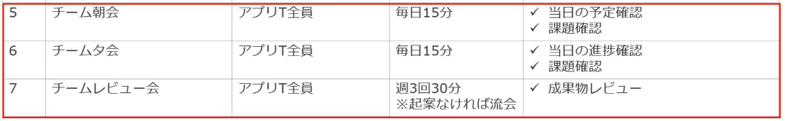

1. #### 전제

   - #### 계획범위는 설계 페이즈부터 단위 테스트 완료까지

2. #### 計画策定

   1. 계획서
      1. 페이즈 공통 계획서
      2. 설계 페이즈 계획서 : 기본설계, 상세설계
      3. 제조 이후 페이즈의 계획서 : 제조, 단위 테스트
   2. 계획시 고려할 것
      1. 계획은 누구를 위한 것인가
         1. 팀 내부 사람들만 이해하면 되는 게 아님
         2. 자신의 팀의 방향성을 선언하는 것과 같으며 다른 팀들도 이해할 수 있어야 함
      2. 계획에 필요한 요소
         1. 5W3H
            1. 왜 만들었나
            2. 우리팀은 무엇을 하는가
            3. 어떤 속도로 진행하는가
            4. 누가 하는가
            5. 어디서 작업하는가
            6. 어떻게 페이즈를 진행시키는가
            7. 어느정도 하는가
         2. 팀 계획
            1. 프로젝트 목적/배경
            2. 페이즈의 목적
            3. 페이즈 방침
            4. 개시조건/완료조건
            5. 성과물 정의
            6. 스케쥴
            7. 환경 (자명하다면 생략)
            8. 체제와 역할
            9. 회의체
         3. 운영방침
            1. 진척관리 룰
               - WBS종류, 작성법, 누가 언제 집계해서 보고하는가, 진척관리 대상이 어디까지인가
            2. 과제관리 룰
               - 이용하는 툴, 기표시의 룰, 회람의 팔로우
            3. 품질관리 룰
               - 리뷰 방식 정의, 품질 분석 방식 정의

2. #### 合意形式
   1. 계획서의 완료는 관계자와의 합의 형성이 이루어진 상태를 말함
   2. 계획서는 요건정의 페이즈 종료 1주일 전에 완성되는 것이 바람직 (バッファを持たす)

3. #### 설계 페이즈 계획

   1. 설계 개시 시 알아둘 것들
      1. 최초 계획에서는 한번 전체를 모두 본다. (見通す)
         - 환경 등의 의뢰가 필요한 경우가 있을지 미리 예상해둔다
      2. 전체를 똑똑히 확인한 후(見据える) 설계 페이즈의 계획를 세운다.
      3. 프로젝트를 진행하며 점점 얻는 정보가 많아지므로 제조, 단위 테스트의 계획은 작성시 상세화하기 때문에 간략하게 작성
      4. 프로젝트 계획(전체)와의 무모순성(整合性)을 확인
      5. 개시 후 1주일 전에는 관계자 합의를 끝낸다.
      6. 개시조건과 완료조건의 정의
         - 개시조건 : ~의 준비가 왼료되어있을 것, ~의 조건을 만족할 것 등
         - 완료조건 : ~가 승인되어 있을 것, ~의 작업이 완료되어 있을것 등
   2. 설계 페이즈 목적
      1. 기본설계
         - 요건정의서를 바탕으로 시스템의 외부사양을 정의하고 기본 설계서에 적용시킨다 (落とし込む)
      2. 상세설계
         - 기본설계서를 바탕으로 프로그렘 레벨의 상세 사양을 정의하고 상세설계서에 적용시킨다.
   3. 소통이 어려운 경우 체크포인트를 만든다.

5. ##### 회의 운영

   

   

6. #### 제조 이후 단위 테스트 페이즈 계획

   1. 마스터 스케쥴, 설계페이즈 계획의 내용과 정합성이 어긋난 경우 다시한번 관계자와 합의
   2. 세세한 룰은 별지로 한다.
   3. 개시 수일 ~ 1주일 전에는 관계자 합의가 끝날 것

7. #### キーパーソン(Key person)

   1. 